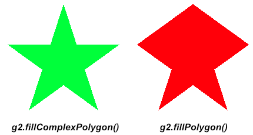

# kha-extension-fill-complex-polygon

An extension for [Kha](http://kha.tech/) that includes a `fillComplexPolygon()` function for [`kha.graphics2.Graphics`](http://kha.tech/api/kha/graphics2/Graphics.html). This function is similar to [`fillPolygon()`](http://kha.tech/api/kha/graphics2/GraphicsExtension.html#fillPolygon), but it can also fill polygons that are not convex. Uses the [earcut](https://github.com/ceramic-engine/earcut.git) polygon triangulation library.

## Comparison with `fillPolygon()`

The following screenshot compares the more advanced triangulation of `fillComplexPolygon()` to the basic `fillPolygon()`. The supplied vertices represent a star with five points, which is a non-convex shape that `fillPolygon()` does not render correctly.



## Installation

Install from the Github repository using the following command:

```sh
haxelib git kha-extension-fill-complex-polygon https://github.com/joshtynjala/kha-extension-fill-complex-polygon.git
```

## Usage

```haxe
import kha.math.Vector2;
using org.josht.kha.graphics2.GraphicsExtension;
```

```haxe
var vertices:Array<Vector2> = [];
// draws a star with 5 points
var points = 5;
var outerRadius = 100.0;
var innerRadius = 38.0;
var startOffset = -Math.PI / 2.0;
var angle = Math.PI / points;
for (i in 0...(2 * points + 1)) {
  var radius = i % 2 == 0 ? outerRadius : innerRadius;
  var x = Math.cos(startOffset + angle * i) * radius;
  var y = Math.sin(startOffset + angle * i) * radius;
  vertices.push(new Vector2(outerRadius + x, outerRadius + y));
}
g2.color = Red;
g2.fillComplexPolygon(20.0, 20.0, vertices);
```